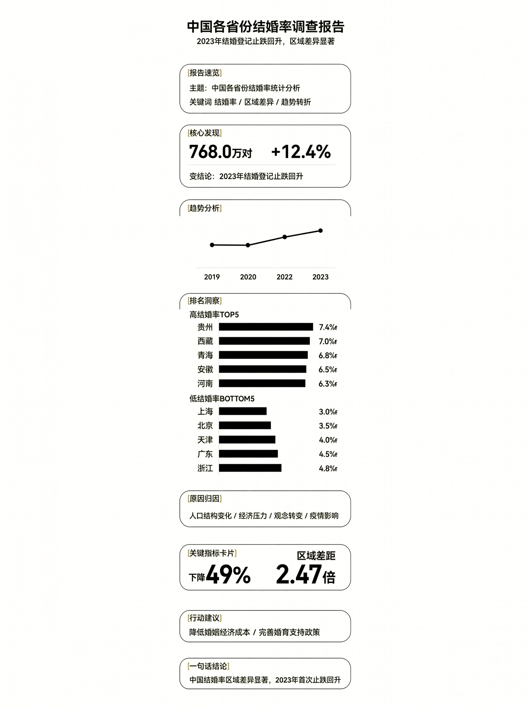

# 图表叙事家 (Chart Storyteller)

**从报告中识别数据形态，自动组装叙事型信息图模块**

一个面向分析报告、研究总结、业务复盘和传播场景的 Wan Skill。核心能力是：
- 先识别报告里有什么数据形态
- 再决定适合讲什么故事
- 最后按叙事逻辑组装信息图模块

## 功能特点

- **智能数据识别**：自动识别报告中的趋势、排名、占比、原因等数据形态
- **动态模块组装**：根据内容动态选择模块，不强求固定结构
- **双版本输出**：标准版（5模块）和高密度版（8模块）
- **4种视觉风格**：简约现代、活泼明亮、深色科技、学术论文
- **高清输出**：支持 1774×2364（3:4竖版），适合移动端阅读

## 风格展示

基于《中国各省份结婚率调查报告》生成的示例：

### 标准版（5模块）

| 简约现代 (minimal) | 活泼明亮 (vibrant) |
|:---:|:---:|
|  |  |
| 白色背景，黑白为主，黄色点缀 | 明亮配色，紫红黄组合，传播感强 |

| 深色科技 (dark) | 学术论文 (academic) |
|:---:|:---:|
|  |  |
| 深色背景，霓虹青紫，未来感 | 米白底色，墨黑线条，严谨规范 |

### 高密度版（8模块）

| 简约现代 (minimal) | 活泼明亮 (vibrant) |
|:---:|:---:|
|  |  |
| 信息精炼，留白更多 | 信息丰富，视觉冲击 |

| 深色科技 (dark) | 学术论文 (academic) |
|:---:|:---:|
|  |  |
| 模块分区清晰，高对比度 | 正式展示，精确对齐 |

## 使用方法

### 1. 提供报告内容
- 报告原文
- 或报告链接（支持飞书文档）
- 或结构化摘要

### 2. 选择输出密度
| 版本 | 模块数 | 适用场景 |
|------|--------|---------|
| 标准版 | 5个 | 汇报扫读、快速理解，文字更少、可读性更高 |
| 高密度版 | 8个 | 一图读懂、完整展示，信息覆盖更全面 |

### 3. 选择视觉风格
| 风格 | 配色特点 | 适用场景 |
|------|---------|---------|
| minimal | 白底、黑白主色、黄色唯一强调 | 清爽传播、简洁展示 |
| vibrant | 紫+洋红+黄，明亮但专业 | 社媒传播、视觉吸引 |
| dark | 深色背景、霓虹青紫、高对比 | 科技内容、趋势主题 |
| academic | 米白底、炭黑线、酒红强调 | 研究报告、论文解读 |

### 4. 生成信息图
默认配置：
- 模型：`wan2.7-image-pro`
- 分辨率：`1774×2364`（3:4竖版）

## 信息图结构

### 必选模块（3个）
1. **报告速览** - 标题、时间范围、研究对象、核心标签
2. **核心发现** - 最重要的发现及数据支撑
3. **一句话结论** - 总结与数据来源

### 动态候选模块（按需选择）
- **趋势分析** - 时间序列、同比环比、增长下降
- **排名洞察** - TOP榜单、头部集中、城市/品牌排序
- **结构对比** - 占比、分布、份额、类别拆分
- **关键指标卡片** - KPI多、需要快速扫读
- **原因归因** - 驱动因素、影响原因
- **行动建议** - 明确建议、策略方向

## 文件说明

```
data-analysis-infograph-skill/
├── README.md                     # 项目说明
├── SKILL.md                      # Skill 核心文档
├── chart-storyteller-prompt-template.md  # Prompt 模板
├── chart-storyteller-style-guide.md      # 风格指南
└── examples/                     # 示例图片
    ├── minimal-standard.png      # 简约现代-标准版
    ├── minimal-dense.png         # 简约现代-高密度版
    ├── vibrant-standard.png      # 活泼明亮-标准版
    ├── vibrant-dense.png         # 活泼明亮-高密度版
    ├── dark-standard.png         # 深色科技-标准版
    ├── dark-dense.png            # 深色科技-高密度版
    ├── academic-standard.png     # 学术论文-标准版
    └── academic-dense.png        # 学术论文-高密度版
```

## 适用场景

- 商业分析报告
- 用户研究报告
- 行业趋势报告
- 竞品复盘报告
- 增长复盘与周报月报
- 移动端一图解读
- 内部汇报型数据总结

## 技术依赖

- Wan2.7-Image 模型（阿里云 DashScope）
- Lark CLI（飞书文档读取）

## License

MIT License

<!-- AUTO-README-START -->

## Auto-generated Project Map

- Project: `data-analysis-infograph-skill`

This block is managed by `update-readme` and can be regenerated at any time.

<!-- AUTO-README-END -->
