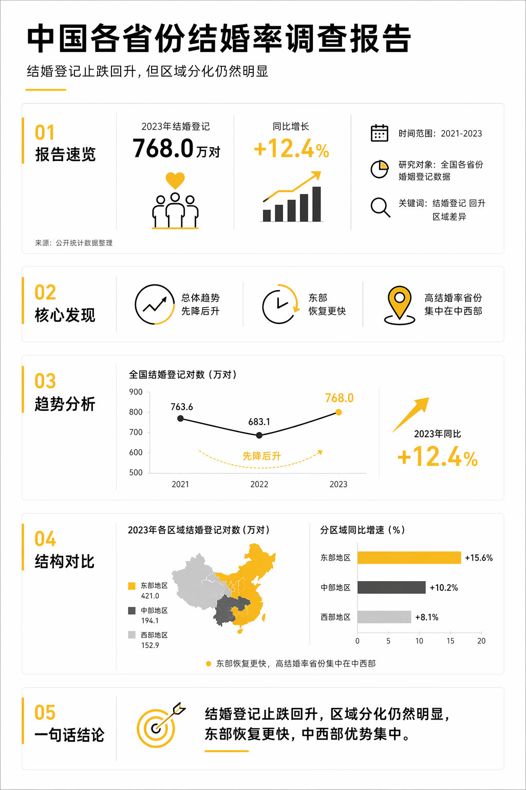
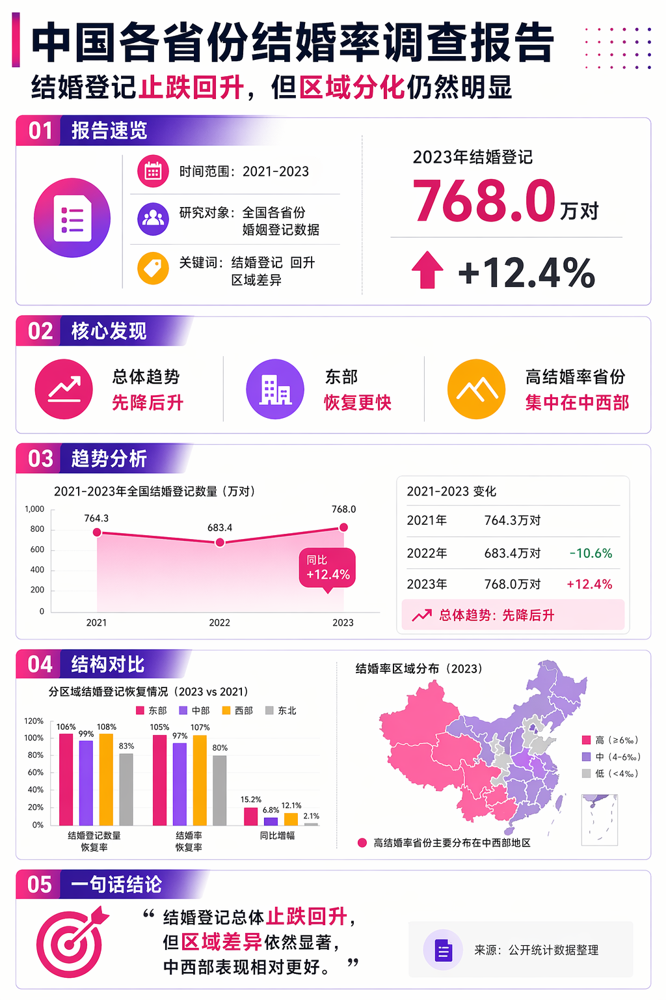
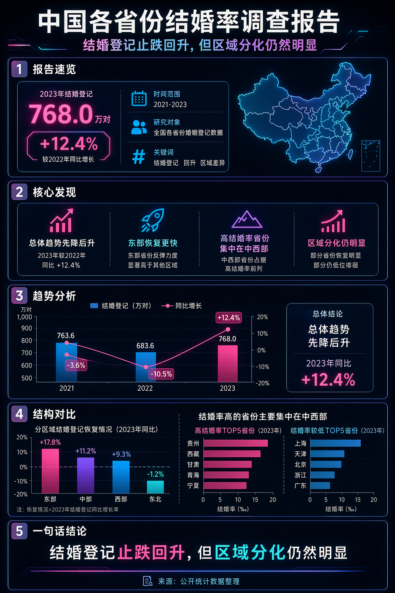
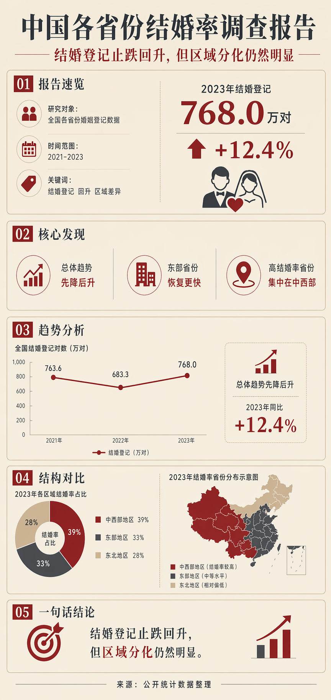
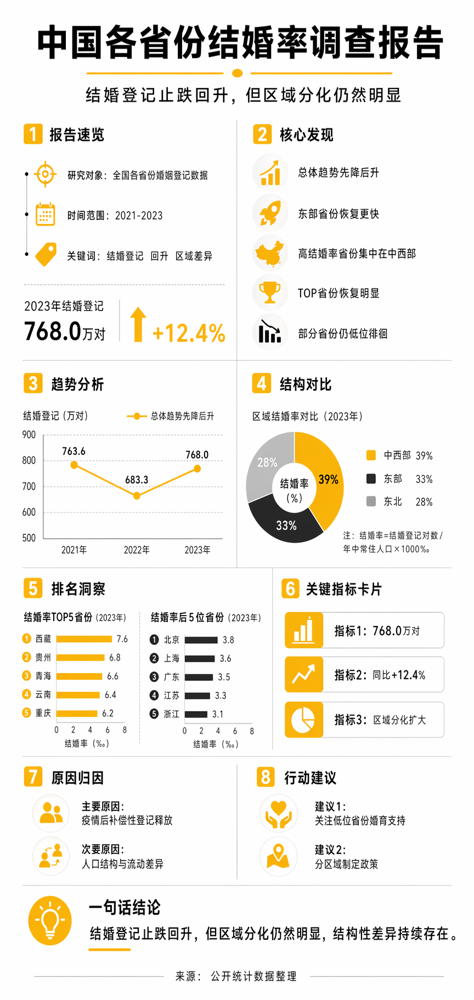
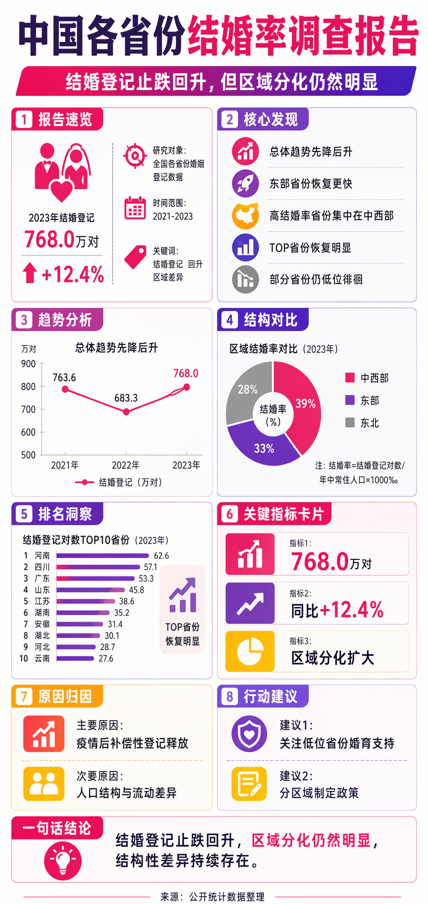
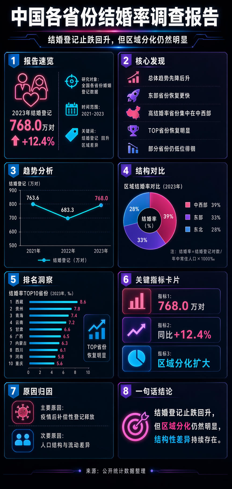
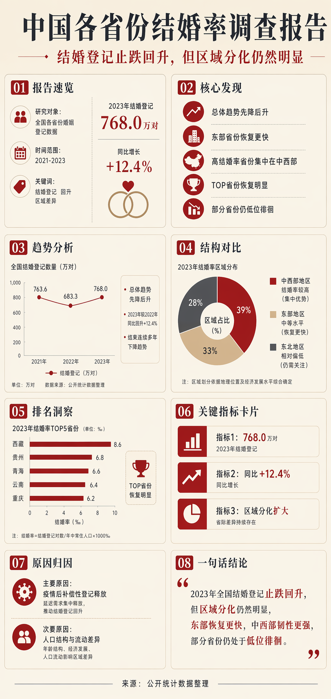

# 图表叙事家 (Chart Storyteller)

从分析报告中识别数据形态，自动组装叙事型信息图模块，生成适合汇报、研究解读和传播展示的竖版数据长图。

图表叙事家不是固定套用图表模板，而是先判断报告里有哪些数据和语义信号，再选择适合的模块讲清楚一个完整故事。

## 核心能力

- **内容识别**：识别趋势、占比、排名、画像、流程、原因、建议等报告信号
- **动态组装**：根据真实内容选择模块，不强行塞入不存在的数据结构
- **双密度输出**：支持标准版 5 模块与高密度版 8 模块
- **四种风格**：简约现代、活泼明亮、深色科技、学术论文
- **高清竖版**：默认 `3072×4096`，保持 3:4 竖版信息图定位
- **中文排版约束**：默认使用黑体风格中文无衬线字体，避免宋体、手写体和装饰字体

## 风格展示

以下示例基于同一份报告内容生成，用于展示不同风格与信息密度的视觉差异。

### 标准版：5 模块

| 简约现代 | 活泼明亮 |
| --- | --- |
|  |  |
| 白色背景，黑白为主，黄色点缀 | 鲜明配色，传播感更强 |

| 深色科技 | 学术论文 |
| --- | --- |
|  |  |
| 深色背景，高对比度，偏科技感 | 暖灰米色底 `#E6DDC8`，正式规整 |

### 高密度版：8 模块

| 简约现代 | 活泼明亮 |
| --- | --- |
|  |  |
| 留白更克制，适合完整扫读 | 信息更满，适合一图传播 |

| 深色科技 | 学术论文 |
| --- | --- |
|  |  |
| 分区清晰，适合趋势和科技主题 | 对齐严谨，适合研究报告和评审展示 |

## 使用方式

正式生成前，需要明确四项输入：

1. **报告内容**：报告原文、报告链接，或结构化摘要
2. **输出密度**：标准版或高密度版
3. **目标风格**：简约现代、活泼明亮、深色科技、学术论文
4. **生图方式**：Codex 内置生图能力，或用户提供的外部生图模型/API

可直接这样描述需求：

```text
请把这份报告做成高密度版信息图，风格用学术论文，使用 Codex 内置生图能力。
```

## 输出密度

| 版本 | 模块数 | 适合场景 |
| --- | ---: | --- |
| 标准版 | 5 | 汇报扫读、快速理解、重点提炼 |
| 高密度版 | 8 | 一图读懂、完整展示、传播长图 |

## 视觉风格

| 风格 | 特点 | 适合场景 |
| --- | --- | --- |
| 简约现代 | 白底、黑白主色、黄色强调，留白更多 | 清爽传播、简洁展示 |
| 活泼明亮 | 颜色更鲜明，节奏更强，视觉吸引力更高 | 社媒传播、活动复盘 |
| 深色科技 | 深色背景、霓虹强调、高对比度 | 科技内容、趋势主题 |
| 学术论文 | 暖灰米色底 `#E6DDC8`、炭黑线、酒红强调 | 研究报告、论文解读、评审展示 |

## 模块策略

每张信息图默认保留 3 个必选模块，保证叙事闭环：

1. **报告速览**：标题、时间范围、研究对象、核心标签
2. **核心发现**：最重要的发现，以及 1-2 条数据支撑
3. **一句话结论**：总结判断，并附上数据来源或研究背景

其余模块根据报告内容动态选择：

- **趋势分析**：时间序列、同比、环比、增长、下降、波动
- **结构对比**：占比、构成、分布、份额、类别拆分
- **排名洞察**：TOP 榜单、领先项、城市/品牌/品类排序
- **关键指标卡片**：多 KPI 快速扫读
- **用户画像**：年龄、性别、城市、客群、消费层级等人群特征
- **流程拆解**：转化路径、用户旅程、步骤流程、漏斗
- **原因归因**：驱动因素、影响因素、增长或下滑原因
- **行动建议**：策略方向、下一步动作、优化建议

## 默认配置

- 默认模型：`wan2.7-image-pro`
- 默认分辨率：`3072×4096`
- 默认画幅：3:4 竖版
- 中文字体：黑体、苹方、思源黑体、Noto Sans CJK SC、SimHei、Heiti 等无衬线风格
- 学术论文背景：暖灰米色 `#E6DDC8`，不要回退为纯白

如果在 Codex 中使用，默认推荐 Codex 内置生图能力；如果使用外部服务，则按用户提供的生图模型或 API 执行。

## 项目文件

```text
data-analysis-infograph-skill/
├── README.md
├── SKILL.md
├── chart-storyteller-feishu-guide.md
├── chart-storyteller-prompt-template.md
├── chart-storyteller-style-guide.md
└── examples/
    ├── minimal-standard.png
    ├── minimal-dense.png
    ├── vibrant-standard.png
    ├── vibrant-dense.png
    ├── dark-standard.png
    ├── dark-dense.png
    ├── academic-standard.png
    └── academic-dense.png
```

## 适用场景

- 商业分析报告
- 用户研究报告
- 行业趋势报告
- 竞品复盘报告
- 增长复盘与周报月报
- 移动端一图解读
- 内部汇报型数据总结

## License

MIT License

<!-- AUTO-README-START -->

## Auto-generated Project Map

- Project: `data-analysis-infograph-skill`

This block is managed by `update-readme` and can be regenerated at any time.

<!-- AUTO-README-END -->
